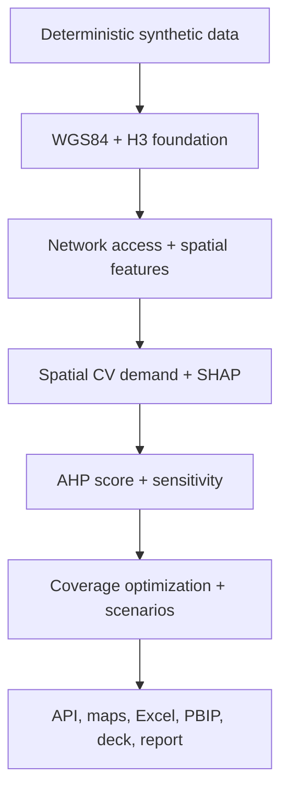

# Geospatial Site Selection & Market Expansion Intelligence

An auditable, end-to-end decision-support platform for the fictional **MarmaraMart**
retail chain in metropolitan Istanbul. The project combines H3 microzones, network
accessibility, competitive white-space analysis, Huff customer-share modeling,
spatially validated demand prediction, SHAP explanations, AHP scoring and constrained
location-allocation.

> **Decision-support only.** All commercial outcomes are deterministic synthetic data.
> No personal or sensitive data is used. Results require field, commercial, legal and
> investment review and are not investment advice.

## Verified run snapshot

The packaged outputs were generated by the local pipeline with seed `20260729`.

| Result | Verified value |
|---|---:|
| H3 resolution-8 microzones | 5,965 |
| Candidates / existing stores / competitors / POIs | 24 / 10 / 96 / 720 |
| Data quality checks | 46 total; 44 pass; 2 warnings; 0 failures |
| Tests / branch coverage | 13 passed / 96.44% |
| Locked dependency audit | 87 packages / 0 known vulnerabilities |
| Spatial CV benchmark | 320 synthetic sites in 33 spatial blocks |
| Out-of-fold MAE / RMSE / R² | TRY 3.819m / TRY 5.732m / 0.964 |
| Top candidate | C24 — Ikitelli Industry, 81.236/100 |
| Base portfolio | C24, C18, C17, C07 |
| Base budget used | TRY 93.382m of TRY 110.000m |
| Base incremental 10-minute population | 1,329,291 |
| Base market coverage | 23.125% |
| Base expected portfolio EBIT | TRY 28.826m |

The two warnings are synthetic points outside the analytical footprint: seven
competitors and sixteen POIs. They are retained deliberately to test spatial coverage
controls and are not critical failures.

## What is implemented

- WGS84 source storage and EPSG:32635 metric calculations.
- Deterministic synthetic business data and performance benchmark.
- Geometry, CRS, coordinate, duplicate, missing-value and spatial-join controls.
- H3 resolution-8 microzones and a connected H3-adjacency transport graph.
- Network-based 5/10/15-minute drive and walk catchments.
- Explicit straight-line versus network-accessibility comparison.
- Competitor, POI, commercial attraction, cost and white-space indicators.
- Huff/gravity capture, diversion and cannibalization metrics.
- Random-forest demand model with 12 km spatial block cross-validation.
- SHAP demand explanations and auditable AHP factor contributions.
- One-at-a-time and 750-draw weight sensitivity.
- Budgeted maximum-coverage optimization with distance and capacity constraints.
- Optimistic, base and pessimistic portfolios.
- FastAPI scoring/scenario service and Prometheus metrics.
- PostGIS schema, GIST indexes, analytical views and validation SQL.
- Interactive Folium maps, Excel, Power BI Project starter, PowerPoint and PDF.
- Docker Compose, Kubernetes, Grafana/Prometheus and security/CI scaffolding.

## Architecture



See [docs/architecture.md](docs/architecture.md) for the full component and data-flow
design.

## Quick start

Python 3.12 is required.

```bash
python -m venv .venv
. .venv/bin/activate
pip install -e ".[dev]"
site-intelligence run --config configs/base.yaml
uvicorn site_intelligence.api.app:app --host 0.0.0.0 --port 8000
```

Core quality gates:

```bash
ruff format --check .
ruff check .
pytest --cov=site_intelligence --cov-report=term-missing --cov-fail-under=90
python scripts/verify_artifacts.py
```

Container stack:

```bash
docker compose up --build
```

OpenAPI is served at `http://localhost:8000/docs`, Prometheus at `:9090`, and Grafana
at `:3000`. Change the local default passwords before any shared deployment.

## Repository map

| Path | Purpose |
|---|---|
| `src/site_intelligence/` | Modular geospatial analytics package and API |
| `data/processed/` | Reproducible pipeline datasets |
| `artifacts/` | Model, metrics, QA, figures and interactive maps |
| `sql/` | PostGIS schema, indexes, views and checks |
| `powerbi/` | PBIP/PBIR/TMDL starter and dashboard blueprint |
| `excel/`, `presentation/`, `report/` | Decision-support deliverables |
| `docs/` | Architecture, governance, model, operations and portfolio material |
| `docker/`, `k8s/` | Deployment and observability configuration |
| `.github/` | CI, CodeQL, dependency and ownership configuration |

## Reproducibility and provenance

- Configuration: `configs/base.yaml`
- Random seed: `20260729`
- Run metrics: `artifacts/metrics/pipeline_summary.json`
- Quality evidence: `artifacts/qa/`
- Artifact hashes: `MANIFEST.sha256`
- Source/license register: `docs/data_source_license_crosswalk.md`

The analytical footprint is a project-specific approximation, not an official
administrative boundary. Interactive maps use OpenStreetMap tiles with attribution.
The network is a deterministic H3-adjacency approximation rather than a live OSM road
graph; independent routing is a pre-investment gate.

## Documentation

- [Turkish README](README_TR.md)
- [Methodology](docs/methodology.md)
- [Model card](docs/model_card.md)
- [Validation and bias assessment](docs/validation_and_bias.md)
- [Data contract and dictionary](docs/data_contract.md)
- [Risk register](docs/risk_register.md)
- [Threat model](docs/threat_model.md)
- [Monitoring runbook](docs/monitoring_runbook.md)
- [Branch protection guide](docs/branch_protection_guide.md)
- [Portfolio and LinkedIn material](docs/portfolio/)

## License

Project code and original documentation are licensed under the
[MIT License](LICENSE). Third-party data, tiles and software retain their own licenses;
see the source/license crosswalk.
