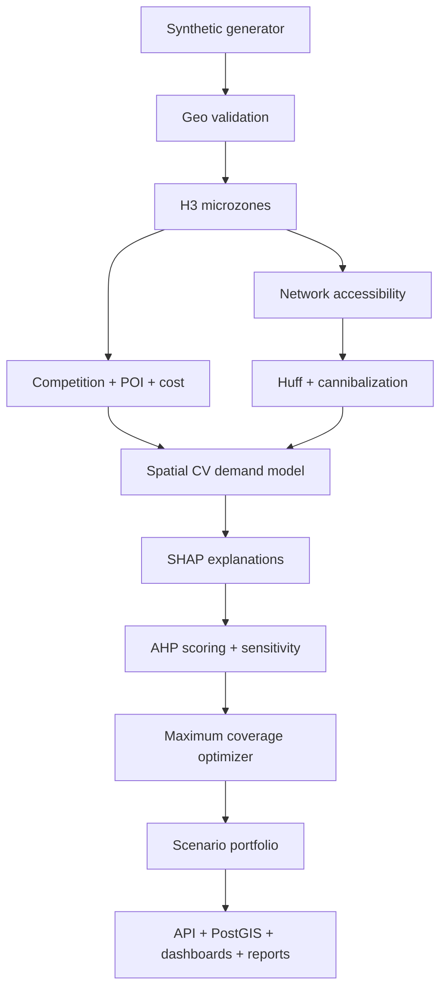
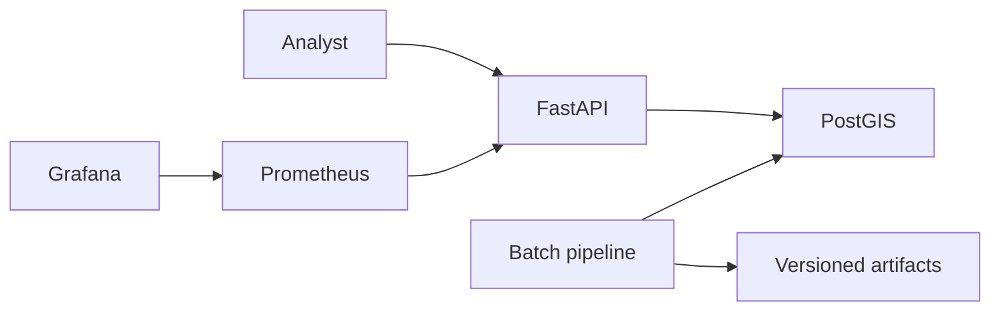

# System Architecture

## Purpose and boundary

The platform ranks individual candidate sites and selects an expansion portfolio for a
fictional Istanbul retailer. It is a batch-first analytical system with a read-only
decision API. It does not authorize capital, replace field surveys, or ingest customer,
device or employee data.

## Logical architecture

## Components

| Component | Responsibility | Key outputs |
|---|---|---|
| `data_generation.py` | Seeded spatial and commercial data | GeoJSON/CSV layers |
| `quality.py` | Contract and geometry gates | Quality check ledger |
| `accessibility.py` | H3 graph and travel-time catchments | 5/10/15-minute populations |
| `enrichment.py` | Cost, density and attraction features | Candidate feature table |
| `gravity.py` | Huff capture, diversion and overlap | Cannibalization measures |
| `modeling.py` | Spatial CV, final model and SHAP | Predictions, intervals, explanations |
| `scoring.py` | AHP weights, normalization, contributions | Auditable location scores |
| `optimization.py` | Binary coverage/location allocation | Scenario selections |
| `maps.py`, `figures.py` | Human-readable visual outputs | HTML and PNG |
| `api/app.py` | Candidate, score and scenario endpoints | JSON and Prometheus metrics |

## Storage

- Source and exchange geometry: EPSG:4326 (WGS84).
- Distance and area calculations: EPSG:32635 (UTM zone 35N).
- Microzone key: H3 resolution 8.
- Analytical files: GeoJSON/CSV for portability.
- Service-ready schema: PostgreSQL/PostGIS with GIST indexes.
- Model: versioned `joblib` artifact with metrics and model card.

## Deployment topology

Docker Compose supplies the local stack. Kubernetes manifests define a stateless API
deployment, service, HPA, PodDisruptionBudget and default-deny network policy. Database
credentials are deployment-time secrets and are not stored in the repository.

## Traceability

Each candidate score can be reconstructed from:

1. raw factor value;
2. factor direction;
3. min-max normalization bounds;
4. AHP weight;
5. normalized factor contribution;
6. summed location score.

The optimizer consumes the scored candidate table and network catchment membership.
Scenario outputs record solver status, selected candidate IDs, cost, coverage, sales,
EBIT and objective value. Artifact hashes and the pipeline summary bind the run.

## Failure containment

- Critical data-quality failure stops publication of results.
- API does not mutate source data, weights or portfolios.
- Weight input is bounded and renormalized.
- Optimizer status is surfaced; infeasible results are never presented as selected.
- Operational dashboards distinguish analytical warnings from service errors.
- Capital approval remains outside the system.

