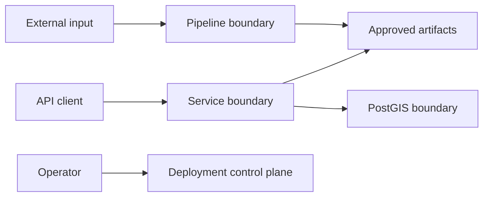

# Threat Model

## Assets

Analytical inputs, score weights, model artifact, scenario constraints, candidate
rankings, manifests, API availability, credentials and reviewer decisions.

## Trust boundaries

## Threats and mitigations

| Threat | Example | Mitigation |
|---|---|---|
| Spoofing | unauthorized operator changes weights | authenticated deployment/BI layer; immutable release |
| Tampering | CSV/model replaced after review | SHA-256 manifest; protected branch and required review |
| Repudiation | undocumented scenario change | configuration, commit and run evidence |
| Information disclosure | secret in compose/log | environment secrets; log minimization; scanning |
| Denial of service | large/repeated API input | schema size limits, ingress rate limit, HPA |
| Elevation of privilege | container escape | non-root/read-only, cap drop, no-new-privileges |
| Analytical manipulation | favorable factor/constraint change | CODEOWNERS, ADR, sensitivity and metric-diff review |
| Supply chain | compromised dependency/image | pinning, Dependabot, pip-audit, CodeQL, Trivy |

## Abuse cases

- passing extreme weights to force a preferred site;
- editing score outputs without regenerating contributions;
- serving stale scenario results after a data refresh;
- interpreting approximate coordinates as an exact available parcel;
- combining real customer/device data with the synthetic pipeline without approval.

## Security requirements

- TLS and authenticated access at ingress for any shared environment.
- Secrets supplied by a managed secret store.
- Database reachable only from approved services.
- API is read-only and has no arbitrary file or SQL input.
- Release artifacts are hash verified.
- Security findings block publication according to severity policy.

## Residual risk

The strongest residual threat is decision misuse: technically correct synthetic output
may be presented as real investment evidence. Persistent disclaimers, reviewer roles and
capital stage gates are therefore security controls as well as governance controls.

